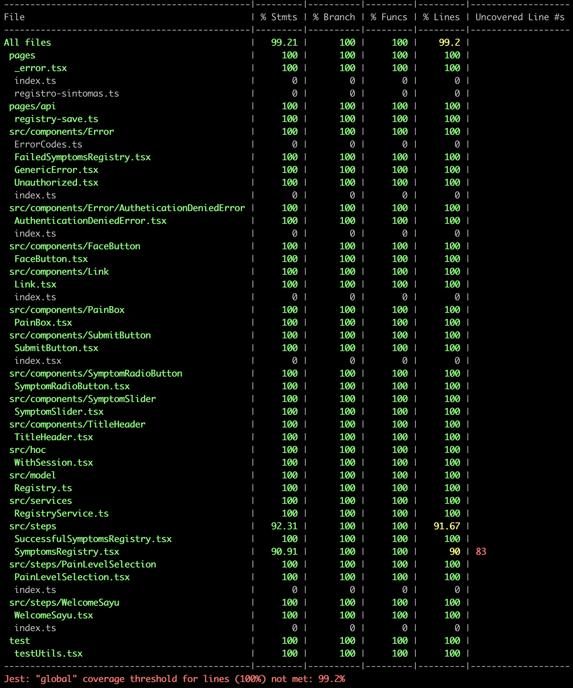
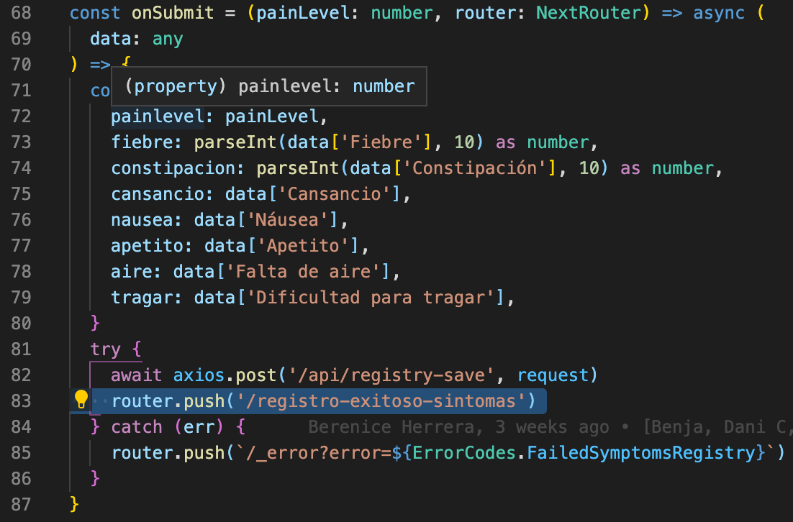
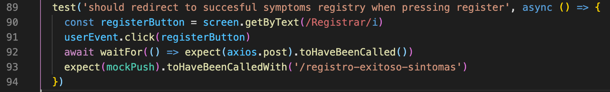
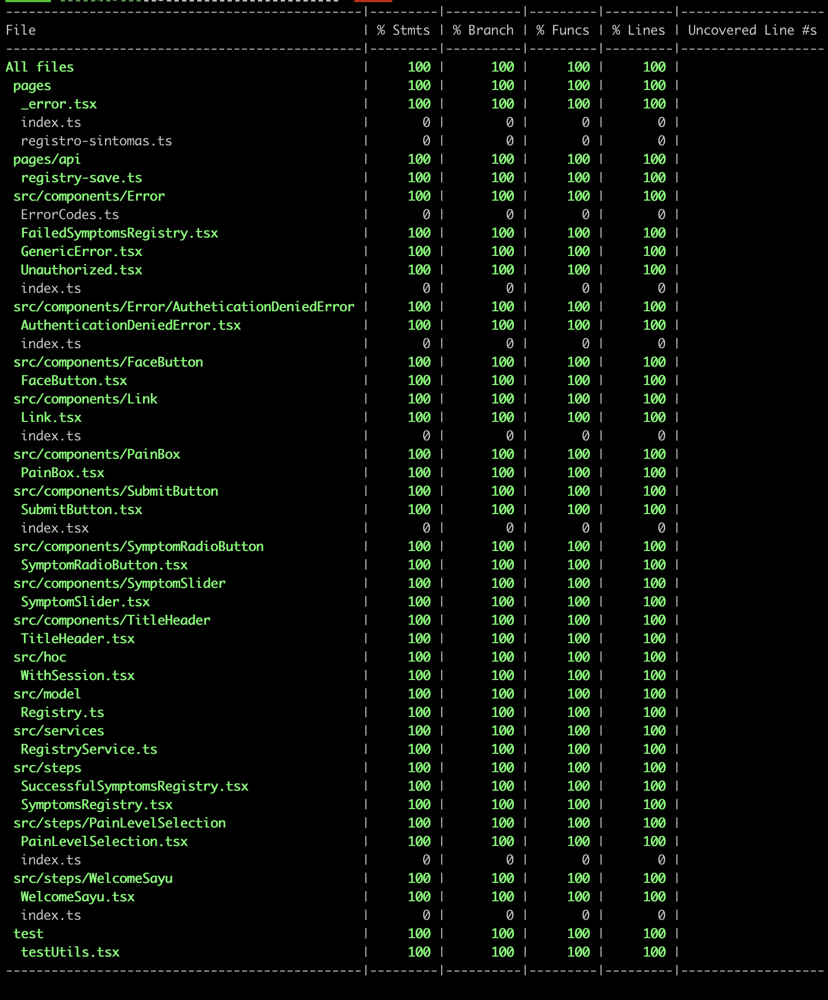

# Test

Para la ejecucion de los test, estamos ocupando [jest](https://jestjs.io/), en combinacion con [react testing library](https://testing-library.com/docs/react-testing-library/intro/).

## 100% coverage y TDD

Como estrategia, estamos cubriendo el 100% de nuestro código, para tener certeza, que el sistema se comporta dentro de los requerimientos establecidos. Si no estamos con un 100% de cobertura en algún test, nos debemos preguntar ¿Por qué tenemos código sin validar su comportamiento? generalmente llegaremos a la misma conclusión, todo código que escribimos debe ser validado por alguna prueba para evitar comportamientos extraños

### ¿Cómo sabemos que líneas nos faltan cubrir?



Como se puede observar, `SymptomsRegistry.tsx` tiene un 90% de sus líneas cubiertas, en este caso, la línea `83` no tiene ningún test que lo toque para revisar su comportamiento, por lo tanto, deberíamos escribir un test para validar su comportamiento.

Se busca la línea sin cubrir


Se crea un test coherente para validar su funcionamiento


Ahora la cobertura está en 100% otra vez 😁


# Comandos

## yarn test

Ejecuta jest con sus parámetros por defecto. Puedes entregar una path para ejecutar un test en particular

```sh
yarn test
```

o

```sh
yarn test test/pages/registro-sintomas.test.tsx
```

## yarn test:watch

Ejecutar un archivo de test en modo `watch`. Jest quedara observando cambios en el codigo y cuando los detecte, volverá a ejecutar el test de forma automática

```sh
yarn test:watch test/pages/registro-sintomas.test.tsx
```

## yarn test:all

Ejecuta todos los test en modo `watch` y obtiene el coverage del sistema. Jest quedará observando cambios en el código y cuando los detecte, volverá a ejecutar todos los test y su coverage automática. Considerar que ejecutar todos los test y su coverage es muy 'pesado' y no es tan inmediato como `yarn test:watch` que solo ejecuta un archivo. Ocupar este comando cuando debas hacer refactorizaciones en todo el sistema y no estés seguro del impacto de esas modificaciones

```sh
yarn test:all
```

## yarn test:coverage

Ejecuta todos los test y obtiene el coverage del sistema.

```sh
yarn test:coverage
```
